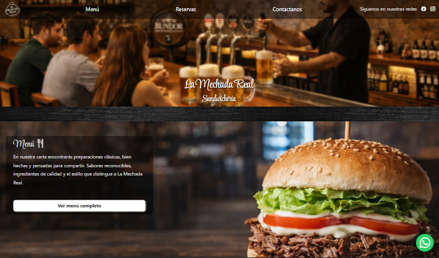
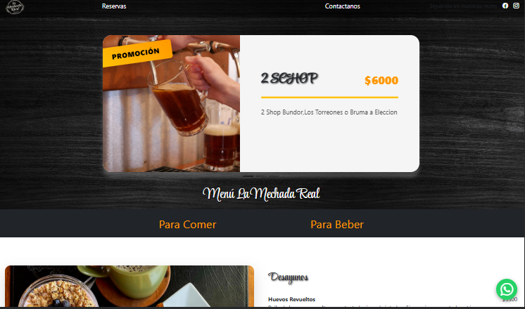
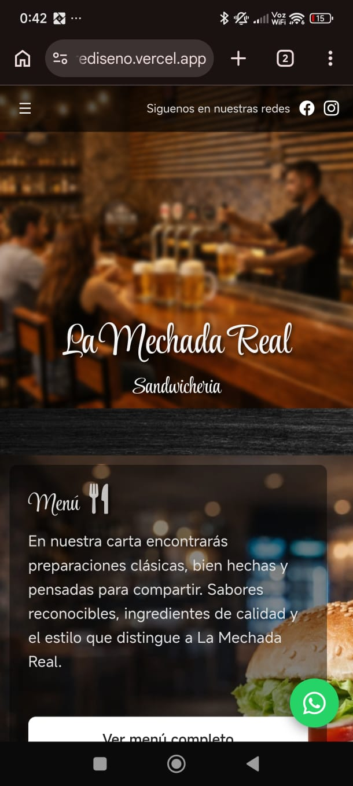

# 🍔 La Mechada Real — Sitio Web & Menú Digital

<p align="center">
  
  
  
  
</p>

---

## 🍟 Sobre el proyecto

**La Mechada Real** es un proyecto de rediseño web para un restaurante que busca mejorar su presencia digital mediante un **sitio moderno, rápido y adaptable a dispositivos móviles**.

El proyecto incluye un **menú digital dinámico conectado a un backend mediante API**, permitiendo actualizar los platos sin modificar el sitio web.

Además, este desarrollo forma la base para un sistema mayor que permitirá a restaurantes **administrar sus menús desde un panel propio**.

---

## 🌐 Demo del sitio

🔗 **Sitio en línea**

```
https://demo-restaurante-rediseno.vercel.app
```

---

## 🖼️ Capturas del proyecto

### 🏠 Página principal



### 📋 Menú digital



### 📱 Vista móvil



---

## ⚙️ Tecnologías utilizadas

| Tecnología          | Uso                       |
| ------------------- | ------------------------- |
| 🌐 HTML5            | Estructura del sitio      |
| 🎨 CSS3             | Diseño visual             |
| ⚡ JavaScript        | Interactividad            |
| 🔌 API REST         | Consumo de menú dinámico  |
| 🗺️ Google Maps API | Ubicación del restaurante |
| ☁️ Vercel           | Deploy del sitio          |

---

## ✨ Funcionalidades principales

### 📋 Menú digital dinámico

El menú del restaurante se obtiene desde un backend mediante API, permitiendo actualizar los productos sin modificar el código del sitio.

### 📱 Diseño responsive

El sitio está optimizado para:

* 💻 escritorio
* 📱 móviles
* 📟 tablets

### 🎉 Promociones destacadas

Secciones visuales que permiten destacar ofertas o productos populares.

### 🗺️ Ubicación integrada

Los clientes pueden ver la ubicación del restaurante directamente desde el sitio mediante Google Maps.

### 📲 Acceso mediante QR

El menú puede abrirse escaneando un **código QR**, ideal para mesas o vitrinas.

### 💬 Contacto rápido

El sitio incluye:

* botón directo de **WhatsApp**
* enlaces a **redes sociales**

---

## 🧠 Arquitectura del proyecto

El proyecto utiliza una arquitectura **frontend desacoplada del backend**.

### Frontend

* Sitio web público
* Consumo de API
* Interfaz del menú

### Backend (en desarrollo)

* Panel de administración
* Gestión de productos
* Gestión de categorías
* Soporte multi-restaurante

Esto permitirá convertir el sistema en una **plataforma de gestión para restaurantes**.

---

## 📂 Estructura del proyecto

```
la-mechada-real
│
├── index.html
├── menu.html
├── reservas.html
│
├── css
│   └── styles.css
│
├── js
│   └── menu.js
│
├── img
│   └── assets
│
└── README.md
```

---

## 🚀 Roadmap

Próximas funcionalidades planificadas:

* 🧑‍🍳 Dashboard para restaurantes
* 📦 Administración de productos
* 🧾 Gestión de categorías
* 📊 Estadísticas de productos más vistos
* 🏪 Soporte multi-restaurante
* 🔐 Autenticación de usuarios

---

## 🎯 Objetivo del proyecto

Crear una solución web escalable que permita a restaurantes pequeños y medianos tener:

✔ Página web profesional
✔ Menú digital administrable
✔ Sistema centralizado para gestionar contenido

---

## 👩‍💻 Autor

**Makarena Pérez**
Desarrolladora Web | Frontend | UI/UX

Proyecto desarrollado como parte de portafolio profesional y evolución hacia una **plataforma de servicios web para restaurantes**.
